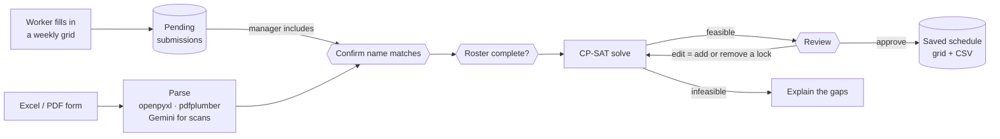

# Service Desk Scheduler

[](https://github.com/ShahidHKhan/scheduler/actions/workflows/tests.yml)


**Builds a university service desk's semester work schedule from staff availability, using a constraint solver and a human-in-the-loop review.**

Every semester, the desk manager used to merge 15–20 individual availability grids into one master schedule by hand, checking a dozen staffing rules along the way. This tool does that bulk work. Workers submit their availability in the app (or send the usual Excel/PDF form), a CP-SAT solver builds a schedule that satisfies every hard rule, and the manager reviews it, adjusts it, and approves it.

It's built for the desk's manager and deployed on Fly.io with a Postgres backend.

## Highlights

- **Optimization, not generation.** The schedule comes from Google OR-Tools' CP-SAT solver, so every hard rule holds by construction. LLMs are used only where the input is messy: reading scanned forms, and grading plain-language explanations in the eval suite.
- **Human-in-the-loop pipeline.** A LangGraph state graph pauses at three decision points (confirm name matches, complete the roster, review the schedule). Its state is checkpointed to Postgres, so a paused review survives restarts and redeploys.
- **Edit and re-solve.** The manager can force anyone in or out of any half hour. Each edit becomes a hard constraint and the week is re-solved around it. Edits that would break the schedule are rejected with a specific reason, and the last good schedule stays on screen.
- **Explains its failures.** When a week can't be staffed, the diagnosis names the slot and the exact reason each person was ruled out, instead of a bare "infeasible".
- **Evaluated LLM output.** An LLM-as-judge checks those explanations. The model only extracts the claims; plain Python decides whether each one is true, so "accurate" can't be a rubber stamp.
- **Production safeguards.** Role-based sign-in, row-level security on every table, a guard against two requests advancing the same run, and a test suite that can never reach the real database.

## How it works



The hexagons are human-in-the-loop gates: the graph pauses with `interrupt()` and resumes when the manager acts in the UI.

1. **Collect availability.** Workers drag across a weekly grid to mark the half hours they can work. Each form becomes a pending submission. Uploaded Excel forms are read from fixed cells, digital PDFs are rebuilt from word coordinates, and scanned PDFs go to Gemini vision, which must return strict JSON or fail loudly.
2. **Confirm the roster.** Each submission is matched to a roster entry by exact name, and the manager confirms every match. A returning worker's manager-set attributes (role, experience, proximity) are never overwritten by a new submission. Solving is blocked until every roster row is complete.
3. **Solve.** One boolean per person × day × half-hour slot × role. Hard rules are constraints. Weekday coverage is a heavily weighted penalty, so the solver leaves a gap only when nothing else works. The objective then maximizes fairness: it minimizes the worst-off person's unmet share of their requested hours.
4. **Review and approve.** The manager sees the schedule grid, each person's hours and any understaffed slots, makes edits, and approves. The approved schedule and the edits it was solved with are saved to the database.

## Scheduling rules

| # | Rule | Type |
|---|------|------|
| 1 | Never schedule anyone above their requested hours (3–20 / week) | hard |
| 2 | Assistant-only staff never work tech slots · hybrid staff aim for 70/30 or 50/50 assistant/tech | hard · soft |
| 3 | Only schedule people in slots they marked available | hard |
| 4 | No two of the newest staff together on a weekday slot · weekend shifts spread fairly | hard · soft |
| 5 | Proximity to campus as a tiebreaker for opens, closes and short blocks | soft |
| 6 | Proportional fairness: minimize the worst-off person's unmet share of requested hours | soft (objective) |
| 7 | Blocks of 2–6 hours | hard |
| — | Weekdays: 2 tech + 2 assistants per slot | soft, heavily penalized |
| — | Weekends 12:00–17:00: exactly 1 tech | hard |

Rule numbers match the comments in `scheduler/solver/build_model.py`. The hybrid ratios, proximity and the weekend cap aren't in the objective yet (see [Roadmap](#roadmap)).

## Design decisions

- **A solver, not an LLM, makes the schedule.** The rules are precise and checkable, and a schedule that silently breaks one is an operational problem. The 2,000× weight on coverage shortfall makes the remaining trade-offs explicit and inspectable.
- **Weekday coverage is soft.** As a hard constraint, a single hard-to-staff slot made the whole week infeasible. Historical schedules show a human scheduler rarely hit full coverage everywhere either.
- **Edits are locks plus a re-solve.** The manager asked for move/lock/re-solve rather than one-off rule overrides. The pipeline keeps the list of accepted edits itself, so only edits that solved are kept and the UI holds no state.
- **People are identified by id, never by name.** Two workers can share a name. Results carry each person's name and initials as they were at solve time, so a saved schedule still reads correctly after the roster changes.
- **Exact name matching with human confirmation.** Every match is reviewed anyway, so fuzzy matching would add risk without saving work.
- **Availability persists on the roster.** Re-uploading one corrected form doesn't erase everyone else's availability (see `tests/test_roster_availability_persistence.py`).
- **Every run starts clean.** A new run resets all pipeline state, so one semester's edits can never leak into the next solve. A regression test covers it.

## Tech stack

| Area | Tools |
|------|-------|
| Optimization | Google OR-Tools (CP-SAT) |
| Orchestration | LangGraph, with Postgres / SQLite checkpointing; LangSmith tracing |
| LLMs | Gemini 2.5 Flash for scanned-form parsing and as an eval judge |
| Data | SQLAlchemy, Postgres on Supabase (SQLite locally) |
| Ingestion | openpyxl, pdfplumber |
| Web app | FastAPI, Jinja2 templates and HTMX; the drag-to-select availability grid is plain JavaScript |
| Quality | pytest, ruff, GitHub Actions |
| Deployment | Docker on Fly.io |

## Project layout

```
web/
  main.py               FastAPI app: sessions, static files, sign-in redirects
  auth.py               Shared role sign-in and the route guards
  routes/               The worker's availability form; the manager's roster, import, review and output tabs
  templates/            Jinja2 pages and the HTMX partials each action swaps in
  static/               CSS, the availability grid script, vendored htmx
scheduler/
  db/                   SQLAlchemy models (roster, submissions, schedules), engine setup, CRUD
  ingest/               xlsx / pdf parsers, Gemini vision fallback, in-app form, name matching
  solver/               CP-SAT model, solve, pre-solve diagnosis, lock validation
  pipeline/             LangGraph graph and state, run lifecycle and checkpointer, display tables
  evals/                LLM-as-judge for infeasibility explanations
scripts/batch_ingest.py Parse a folder of submissions from the command line
tests/                  pytest suite
Dockerfile, fly.toml    Container and Fly.io deployment
```

`scheduler/` has no web code at all. Each route in `web/` reads a form, calls one `scheduler` function and renders a template; an HTMX request gets back just the part of the page that changed.

## Running locally

Requires Python 3.12.

```bash
python -m venv .venv
source .venv/bin/activate          # Windows: .venv\Scripts\activate
pip install -r requirements-dev.txt
cp .env.example .env               # then fill in the values below

uvicorn web.main:app --reload      # http://localhost:8000 (creates the tables on first run)
```

| Variable | Needed for |
|----------|------------|
| `APP_USERNAME`, `APP_PASSWORD` | Worker sign-in: opens only the availability form |
| `ADMIN_APP_USERNAME`, `ADMIN_APP_PASSWORD` | Manager sign-in: opens the scheduler |
| `GEMINI_API_KEY` | Scanned-PDF parsing and the live judge test (optional otherwise) |
| `DATABASE_URL` | Postgres. Leave empty to use local SQLite (`DATABASE_PATH`, default `roster.db`) |
| `SESSION_SECRET` | Signs the session cookie. Without it, everyone is signed out whenever the app restarts |
| `LANGCHAIN_TRACING_V2`, `LANGCHAIN_API_KEY`, `LANGCHAIN_PROJECT` | Optional LangSmith tracing of the pipeline |

Self-contained demos with synthetic data:

```bash
python -m scheduler.solver.solve       # solve a 20-person week
python -m scheduler.pipeline.graph     # run the full pipeline through its pause points
```

## Tests

```bash
pytest -q
ruff check .
```

The suite runs real solves and checks the output against each hard rule. It also covers coverage under shortage, infeasibility diagnosis, the full edit/re-solve/approve loop through LangGraph, run isolation and restart recovery, the web app end to end over HTTP (a worker submits, the manager runs, edits, approves and downloads), role-based access, and the LLM judge, whose live Gemini test skips when no key is set. CI runs lint and tests on every push and pull request.

Tests always use throwaway SQLite databases. `tests/conftest.py` blanks `DATABASE_URL` before anything loads `.env`, so the suite can never reach a real database. The Postgres checkpointer and row-level security tests run only when `TEST_POSTGRES_URL` points at a disposable database, for example one started with Docker.

## Deployment

The app runs as a single Docker container on [Fly.io](https://fly.io), scaled to zero when idle. The roster, submissions, approved schedules and the pipeline's checkpoints live in [Supabase](https://supabase.com) Postgres. The app turns on row-level security for every table it creates, which closes them to Supabase's built-in REST API; the app owns the tables, so it isn't affected. Secrets, including `SESSION_SECRET`, are set with `flyctl secrets`.

```bash
flyctl deploy
```

It runs on a single machine on purpose: the guard that stops two requests from advancing the same run works within one process.

## Roadmap

- **Richer objective.** Add the hybrid role ratios, proximity and the weekend cap.
- **More real inputs.** Validate the PDF and scanned-PDF paths against more real submissions.
