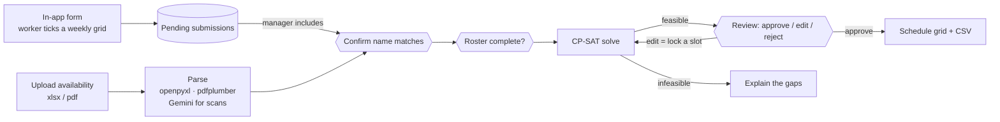

# Service Desk Scheduler

[](https://github.com/ShahidHKhan/scheduler/actions/workflows/tests.yml)

A tool that builds a university service desk's semester work schedule. It collects each worker's weekly availability (filled in directly in the app, or uploaded as the Excel/PDF form), solves the desk's staffing rules with a constraint solver, and gives the desk manager a review screen to adjust, re-solve and approve the result.

The manager used to build this schedule by hand from 15–20 individual grids. The tool automates that bulk work and leaves the final adjustments to the manager.

## How it works

The schedule is produced by a **deterministic solver, not an LLM**. The staffing rules are precise and checkable, and a schedule that silently breaks one is an operational problem. LLMs are used only where the input is messy: reading scanned availability forms, and evaluating plain-language explanations of why a schedule couldn't be built.



The pipeline is a [LangGraph](https://github.com/langchain-ai/langgraph) state graph. The hexagons are human-in-the-loop gates: the graph pauses with `interrupt()`, its state is saved by a checkpointer, and it resumes when the manager acts in the UI.

- **In-app submissions.** Workers fill in a clickable weekly grid with their name, initials and hours. Each one is saved as a pending submission in its own table. The manager chooses which to include in a run, and from there they follow the same path as uploaded files, so nothing reaches the roster without the name-match confirmation.
- **Ingestion** parses the fixed-layout xlsx template directly. Digital PDFs are rebuilt from word coordinates. Scanned PDFs go to Gemini vision, which must return strict JSON and fails loudly rather than guessing.
- **Roster.** Submissions create or update roster rows with name, hours and availability. In-app submissions also supply initials, but never overwrite initials the manager already set. The manager fills in the rest: role, experience rating and proximity. Solving is blocked until every row is complete.
- **Solver.** OR-Tools CP-SAT, with one boolean per person × day × half-hour slot × role. Hard rules are constraints. Weekday coverage is a heavily weighted penalty, so the solver only leaves a gap when nothing else works.
- **Review loop.** Each manual edit becomes a lock (force a person in or out of a slot) and the week is re-solved around it. Contradictory locks are rejected before solving. If an edit makes the week infeasible, the last good schedule stays on screen.
- **Diagnosis.** When a weekend slot can't be staffed, `diagnose.py` names the slot and the specific reason each person was ruled out.

## Scheduling rules

| # | Rule | Type |
|---|------|------|
| 1 | Never schedule anyone above their requested hours (3–20 / week) | hard |
| 2 | Assistant-only staff never work tech slots · hybrid staff aim for 70/30 or 50/50 assistant/tech | hard · soft |
| 3 | Only schedule people in slots they marked available | hard |
| 4 | No two rating-1 (newest) staff together on a weekday slot · weekend shifts spread fairly | hard · soft |
| 5 | Proximity to campus as a tiebreaker for opens, closes and short blocks | soft |
| 6 | Proportional fairness: minimize the worst-off person's unmet share of requested hours | soft (objective) |
| 7 | Blocks of 2–6 hours | hard |
| — | Weekdays: 2 tech + 2 assistants per slot | soft, heavily penalized |
| — | Weekends 12:00–17:00: exactly 1 tech | hard |

Rule numbers match the comments in `scheduler/solver/build_model.py`. The hybrid ratios, the weekend cap and proximity aren't in the objective yet (see [Roadmap](#roadmap)).

## Project layout

```
app.py                  Streamlit UI: Submit Availability, Roster, Import, Review & Edit, Output tabs
scheduler/
  db/                   SQLAlchemy roster model, engine setup, CRUD
  ingest/               xlsx / pdf parsers, Gemini vision fallback, in-app form, name matching
  solver/               CP-SAT model, solve, pre-solve diagnosis, lock validation
  pipeline/             LangGraph graph and state, schedule grid formatting
  evals/                LLM-as-judge for infeasibility explanations
scripts/batch_ingest.py Parse a folder of submissions from the command line
tests/                  pytest suite
Dockerfile, fly.toml    Container and Fly.io deployment
```

## Running locally

Requires Python 3.12.

```bash
python -m venv .venv
source .venv/bin/activate          # Windows: .venv\Scripts\activate
pip install -r requirements-dev.txt
cp .env.example .env               # then fill in the values below

streamlit run app.py               # http://localhost:8501 (creates the roster table on first run)
```

| Variable | Needed for |
|----------|------------|
| `APP_USERNAME`, `APP_PASSWORD` | The app's login screen |
| `GEMINI_API_KEY` | Scanned-PDF parsing and the live judge test (optional otherwise) |
| `DATABASE_URL` | Postgres. Leave empty to use local SQLite (`DATABASE_PATH`, default `roster.db`) |
| `LANGCHAIN_TRACING_V2`, `LANGCHAIN_API_KEY`, `LANGCHAIN_PROJECT` | Optional LangSmith tracing of the pipeline |

Self-contained demos with synthetic data:

```bash
python -m scheduler.solver.solve       # solve a 20-person week
python -m scheduler.pipeline.graph     # run the full pipeline through its pause points
```

## Tests

```bash
pytest -q
ruff check .
```

The suite runs real solves and checks the output against each hard rule. It also covers weekday coverage under shortage, infeasibility diagnosis, the lock/edit/re-solve loop through LangGraph, a regression test for roster availability persistence, and the LLM judge. The judge's accuracy check is plain Python cross-referencing; the one live Gemini test skips when no key is set.

Tests always run against a throwaway SQLite database. `tests/conftest.py` drops `DATABASE_URL` so a local `.env` can never point the suite at a real database. CI runs on every push and pull request to `main`.

## Deployment

The app runs as a single Docker container on [Fly.io](https://fly.io), with the roster in [Supabase](https://supabase.com) Postgres. Secrets (`DATABASE_URL`, `GEMINI_API_KEY`, `APP_USERNAME`, `APP_PASSWORD`, LangSmith keys) are set with `flyctl secrets`. Machines stop when idle and start on the next request.

```bash
flyctl deploy
```

I chose this stack because I had already run Fly.io and Supabase in production on earlier projects, so deployment was routine plumbing rather than new infrastructure. I considered Streamlit Community Cloud and rejected it because its filesystem doesn't persist across restarts.

## Design decisions

- **Solver over LLM for the schedule.** Every hard rule is guaranteed by construction, and the 2,000× weight on coverage shortfall makes the trade-offs explicit and inspectable.
- **Weekday coverage is soft.** As a hard constraint, a single hard-to-staff slot made the whole week infeasible. Historical schedules show a human scheduler rarely hit 2+2 everywhere either.
- **Exact name matching with human confirmation.** Every match is reviewed anyway, so fuzzy matching would add risk without saving work.
- **Edits are locks plus re-solve.** The manager asked for move/lock/re-solve, not one-off rule overrides.
- **Availability persists on the roster row.** Re-uploading one corrected form doesn't erase everyone else's availability (see `tests/test_roster_availability_persistence.py`).

## Roadmap

- Add the hybrid role ratios, proximity and the weekend cap to the objective.
- Move the LangGraph checkpointer to Postgres so a paused review survives a restart, and store approved schedules in the database.
- Validate the PDF and scanned-PDF paths against more real submissions.
- Let edits use clock times rather than slot indices.
